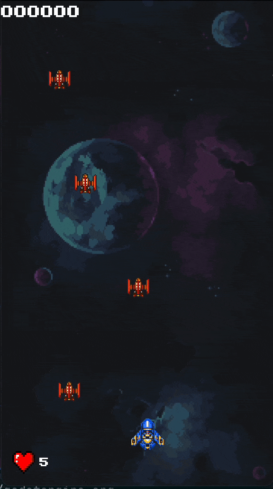

This is the code that I presented during the live coding session.

I've refactored it a little bit; but nothing major. I've also added a simple _game over_ screen, how to restart the game, and a scrolling background; since those were questions during the demo.

To run this; install Godot and import the godot.project file into the IDE.
Enjoy!

